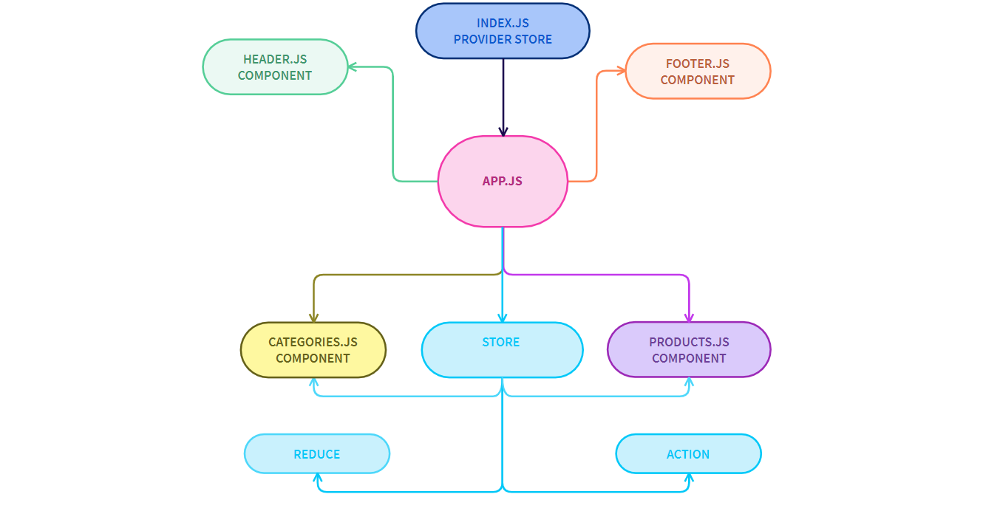

# **StoreFront APP**

## **Redux**

### **LAB - 37**

## **Phase 1 Requirements**

Today, we begin the first of a 4-Phase build of the storefront application, written in React. In this first phase, our goal is to setup the basic scaffolding of the application with initial styling and basic behaviors. This initial build sets up the file structure and state management so that we can progressively build this application in a scalable manner

The following user/developer stories detail the major functionality for this phase of the project.

* As a user, I expect to see a list of available product categories in the store so that I can easily browse products
* As a user, I want to choose a category and see a list of all available products matching that category
* As a user, I want a clean, easy to use user interface so that I can shop the online store with confidence

### **Author: Farah AlWahaibi**

* [PR LINK1](https://github.com/farahalwahaibi/stoRefont/pull/1)
* [PR LINK2](https://github.com/farahalwahaibi/stoRefont/pull/2)
* [PR LINK3](https://github.com/farahalwahaibi/stoRefont/pull/3)

### **Installation**
* **dependencies :**
  *  "@testing-library/jest-dom"
  *  "@testing-library/react"
  *  "@testing-library/user-event"
  *  "react"
  *  "react-dom"
  *  "react-router-dom"
  *  "react-scripts"
  *  "web-vitals"
  *  "react-bootstrap"
  *  "redux"
  *  "react-redux"
  *  "redux-devtools-extension"

### **Running the app**
* **npm start**

## **UML DIAGRAM PHASE-1**

